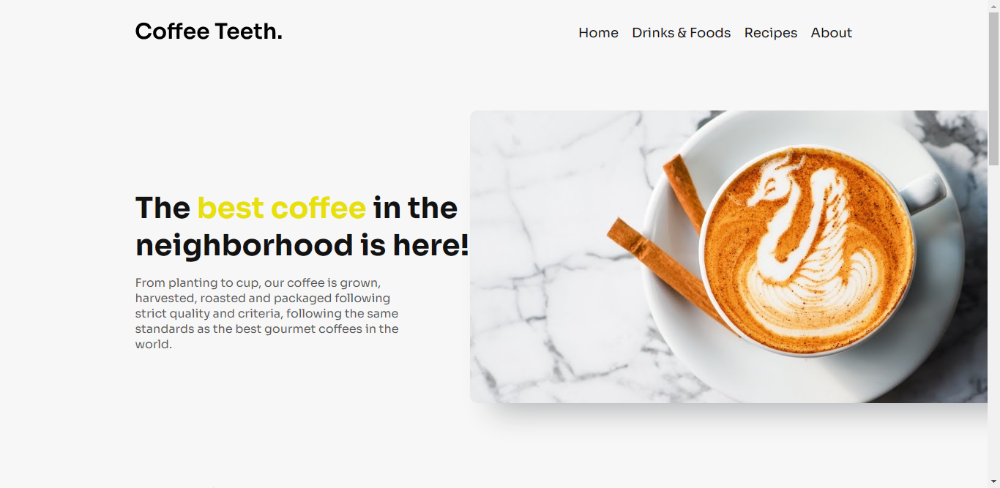

<h1 align="center"> Coffee Teeth - Blog </h1>

O Coffe Teeth vem trazendo café de qualidade de nossa cafeteria, além de compartilhar receitas que vão melhorar o seu dia.

  <a href="#-tecnologias">Tecnologias</a>&nbsp;&nbsp;&nbsp;|&nbsp;&nbsp;&nbsp;
  <a href="#-projeto">Projeto</a>&nbsp;&nbsp;&nbsp;|&nbsp;&nbsp;&nbsp;
  <a href="#-contato">Contato</a>

  

 

  

## 🚀 Tecnologias

Esse projeto foi desenvolvido com as seguintes tecnologias:

- HTML
- SASS
- JavaScript DOM

## 💻 Projeto

O **Coffee Teeth** é um blog de uma cafeteria fictícia inventada por mim. Um site apresenta seus produtos e suas receitas, que segue os mesmos padrões dos melhores cafés gourmet do mundo.

Dê uma olhada no projeto clicando nesse [link](https://matheusfdosan.github.io/coffee-teeth/).

## Contato

- Acesse também meus outros repositórios no [Github](https://github.com/matheusfdosan?tab=repositories).

- Também me siga no [Instagram](https://instagram.com/matheusfdosan).
